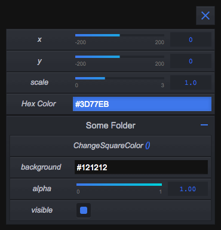

[](http://github.com/badges/stability-badges)

# gui-gui

GUI tool in commonjs for creative coding projects. 
Inspired from dat.GUI.
Development in progress.
Check out the [demo](https://superguigui.github.io/gui-gui).




## Install
From npm but not yet.

## Getting started
```javascript
var Gui = require('gui-gui');

var someObject = {
  x: 0
};

var gui = new Gui();

gui.add(someObject, 'x', {
  label: 'x', 
  min: -200, 
  max: 200, 
  step: 1
}).on('update', function(value) {
  // some stuff when slider value is updated
});
```

## Available components
Here's a list of the components you can use 

### Slider
A slider to manipulate numerical values

### Toggler
A button with a truthy and a falsy state to handle booleans. Equivalent to checkbox.

### Launcher
A button to launch a function.

### Colorpicker
To handle colors.

### Folder
A folder to put other components in.