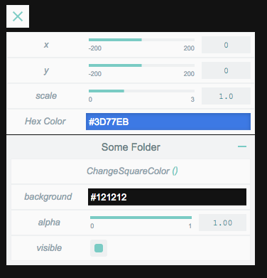

[](https://travis-ci.org/superguigui/guigui) [](http://github.com/badges/stability-badges)

# guigui

GUI tool in commonjs for creative coding projects.
Inspired from dat.GUI.
Development in progress.
Check out the [demo](https://superguigui.github.io/guigui).


## Install
```bash
npm install guigui --save
```

## Getting started
```javascript
var Gui = require('guigui');

var targetObject = {x: 0};

var gui = new Gui();
gui.add(targetObject, 'x');
```

## Available components
Here's a list of the components you can use

- `Slider` to manipulate numerical values in a given range.
- `Toggler` a button with a truthy and a falsy state to handle booleans. Equivalent to checkbox.
- `Launcher` a button to launch a function.
- `Colorpicker` To handle colors.


Additionnaly you can add `Folders` to the main GUI which in turn can contain all of the above components.


## API
### `new Gui([options])`
Creates a new instance of `guigui`. Options is an object which can have the following properties:
- `theme` a string that will determine the color scheme our instance will use. For now only `light` and `dark` are available and it defaults to `dark`.
- `top` a number. Distance in pixel from top of parent container.
- `left` a number or a string. Distance in pixel from left of parent container. Defaults to `auto` which will be used as the actual css `left` property of our `guigui` instance.
- `right` a number or a string. Distance in pixel from right of parent container. Defaults to `10` which will be used as the actual css `right` property of our `guigui` instance.
- `container` the dom element the `guigui` instance will be appended to. Defaults to `document.body`.

### `gui.add(targetObject, property, [options])`
Will add a component to our `guigui` instance that will be tracking `targetObject[property]` and return this component. The type of `targetObject[property]` will determine what kind of component will be added. Components type include `Slider` for numerical values, `Toggler` for booleans and `Launcher` for functions.

Options is an object which can have the following properties:
- `label` a string to rename the component. Will default to `property`.
- `watch` a boolean to specify if the component should auto update when `targetObject[property]` is changed outside of the Gui.
- `min` only works with `Slider`, is a number which represents the minimal value the slider can go to.
- `max` only works with `Slider`, is a number which represents the maximal value the slider can go to.
- `step` only works with `Slider`, is a number which determines the precision of components value. Also this value is the one that will be used for single incrementations when dragging vertically from the text input.


### `gui.addColorPicker(targetObject, property, [options])`
Will add a `ColorPicker` component to our `guigui` instance that will be tracking `targetObject[property]` and return it. `ColorPicker` components can't be created using the `add` method to avoid confusion with numbers detection as colors can be represented by numbers. The optionnal `options` object is similar from the one from the `gui.add` function.
- `label` a string to rename the component. Will default to `property`.
- `watch` a boolean to specify if the component should auto update when `targetObject[property]` is changed outside of the Gui.


### `gui.addFolder(folderName)`
Will add a folder to our `guigui` instance and returns it. Both `add(...)` and `addColorPicker(...)` methods are available on a folder object.

## Callbacks and events
Additionnaly all components are also `EventEmitter` and you can listen for value changes like so :
```javascript
gui.add(targetObject, 'x').on('update', function(value) {
  // do something with value
});
```
The `update` event is the only one available at the moment.


## Themes
Two themes are available at the moment: `dark` and `light`.




## Motivations
This library was mainly made as an exercise, and also to fill my need for a GUI tool for creative development.
I also encountered various annoying behaviors with dat.GUI that i wished to avoid here :
* Slider value representation should ALWAYS be based on the `step` param.
* Sometimes the colorPicker of dat.GUI will become black when trying to edit the text input.
* Min and Max of slider should be displayed.

## What's next
- [ ] Scrolling
- [ ] Select component
- [ ] String input component
