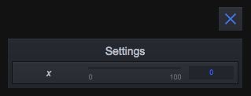
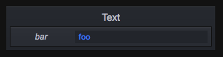

[](https://travis-ci.org/superguigui/guigui) 

# guigui

GUI tool for creative coding projects Inspired from dat.GUI.
Check out the [demo](https://superguigui.github.io/guigui).

## Install
```bash
npm install guigui --save
```

## Getting started
```javascript
var guigui = require('guigui');

var targetObject = {x: 0};

guigui.add(targetObject, 'x');
```



A couple things happened here. First by calling the add Method of guigui, you automatically created a panel called `Settings` in which your component will go. Then guigui detected the type of the `x` property from `targetObject` to be a Number and picked the slider component accordingly.

## Components
When possible guigui will auto detect the targeted property type and chose which component should be used. Here are the available components.
- `Slider` to manipulate numerical values in a given range.
- `Toggler` a button with a truthy and a falsy state to handle booleans. Equivalent to checkbox.
- `Launcher` a button to launch a function.
- `Text` a text input for string modification.
- `Select` a dropdown select component.
- `Colorpicker` To handle colors.

The select component will be invoked for a Number or a String if the third parameter of the `guigui.add()` function is an array.

Also the ColorPicker cannot be invoked from the `add` function. Instead you need to call the `guigui.addColorPicker()` function.

For all components you can use a third options arguments to configure the component more precisely. See below for more explanations.

```javascript
// The source object we want to control
const myObject = {
  num: 9,
  name: 'My Object',
  action: () => {},
  isActive: false,
  color: '#FF0000',
  type: 'awesome'
}

// Add some components to control myObject
guigui.add(myObject, 'num')
guigui.add(myObject, 'name')
guigui.add(myObject, 'action')
guigui.add(myObject, 'isActive')

// Special cases, Select and ColorPicker components
guigui.add(myObject, 'type', ['awesome', 'nice', 'crappy'])
guigui.addColorPicker(myObject, 'color')
```


## Panels and folders
If you don't do it yourself, guigui will automatically create a panel called `Settings` when you first use `guigui.add(...)`. You can however create any number of panels yourself with the `guigui.addPanel()` method.
```javascript
// manually create panels
const panel1 = guigui.addPanel('Panel1')
const panel2 = guigui.addPanel('Panel2')

// create components inside these panels
const o = {a: 0, b: 1, c: 2}
panel1.add(o, 'a')
panel1.add(o, 'b')
panel2.add(o, 'c')
```


Each panel can contain components and folders. To create a folder in a panel you need to call the `guigui.addFolder()` method.
```javascript
// creates folder in guigui default panel
const f1 = guigui.addFolder('Folder1')
const f2 = guigui.addFolder('Folder2')

// add folders to another folder
const subF1 = f1.addFolder('SubFolder1')
const subF2 = f1.addFolder('SubFolder2')
```


## Slider
Controls a number.
```javascript
const o = {a: 0.6}

guigui.add(o, 'a', {
  min:      0, // default is 0
  max:      1, // default is 100
  step:   0.1, // default is 1
  label: 'foo', // default is target property's name (here "a")
  watch: false // default is false
})
```


## Text
Controls a string.
```javascript
const o = {a: 'foo'}

guigui.add(o, 'a', {
  label: 'bar' // default is target property's name (here "a")
  watch: false, // default is false
})
```


## Toggler
Controls a boolean.
```javascript
const o = {a: true}

guigui.add(o, 'a', {
  label: 'foo', // default is target property's name (here "a")
  watch: false // default is false
})
```


## Launcher
Launches a function.
```javascript
const o = {a: () => {}}

guigui.add(o, 'a', {
  label: 'foo', // default is target property's name (here "a")
  watch: false // default is false
})
```


## Select
Changes a value from an array of choices.
```javascript
const choices = [0, 1, 2, 3]
const o = {a: 0}

guigui.add(o, 'a', choices, {
  label: 'foo', // default is target property's name (here "a")
  watch: false // default is false
})
```


## ColorPicker
Controls hex colors from string or number. It's also compatible with THREE.js Color class.
```javascript
const o = {
  css: '#DA5137',
  hex: '#84AF52',
  three: new THREE.Color(0x97C4E9)
}

guigui.addColorPicker(o, 'css', {
  label: 'foo', // default is target property's name (here "css"),
  watch: false // default is false
})
guigui.addColorPicker(o, 'hex')
guigui.addColorPicker(o, 'three')
```


## Callbacks and events
All components can be passed a `watch` option, a boolean, to specify if the component should auto update when `targetObject[property]` is changed outside of the Gui. This option defaults to false.
```javascript
const o = {x: 0, y: 0}
gui.add(o, 'x', {watch: true})
o.x = 1
// our slider component value will be updated to 1

gui.add(o, 'y', {watch: false})
o.y = 2
// our slider component value did not change
```


Additionnaly all components extend `EventEmitter` and you can listen for value changes for custom behaviors.
```javascript
gui.add(o, 'x').on('update', value => {
  // do something with value
})
```

## Motivations
This library was mainly made as an exercise, and also to fill my need for a GUI tool for creative development.
I also encountered various annoying behaviors with dat.GUI that i wished to avoid here :
* Slider value representation should ALWAYS be based on the `step` param.
* Sometimes the colorPicker of dat.GUI will become black when trying to edit the text input.
* Min and Max of slider should be displayed.

## What's next
- [ ] Panel Scrolling
- [ ] Drag and drop
- [ ] Themes

